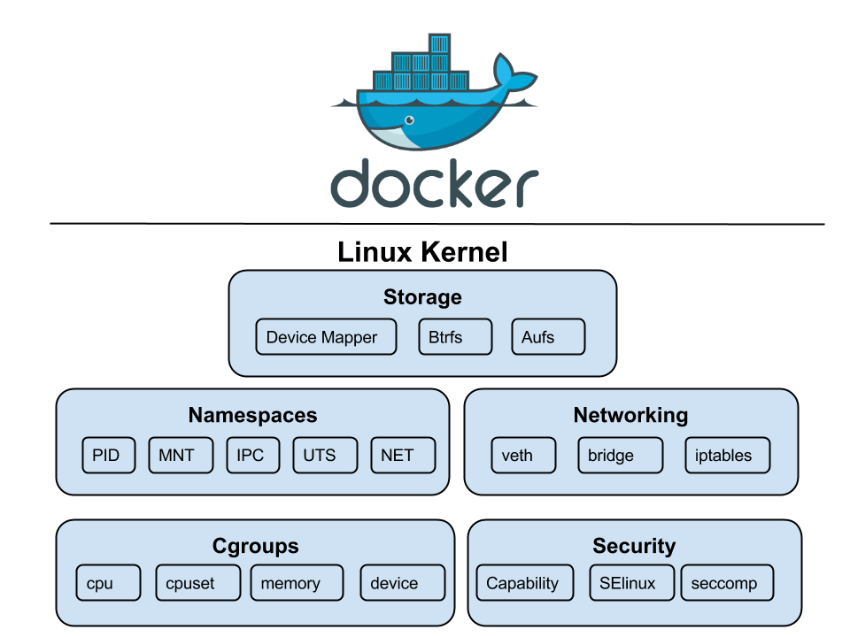

Containers are a great way to deploy and run applications because they’re lightweight, portable, and efficient. Because they package an application with all its dependencies, containers ensure the application runs consistently and reliably across different computing environments. But one thing that makes them different is that THEY ARE NOT VIRTUAL MACHINES.

A VM is like having a whole separate computer in a box, complete with its own operating system, which is a bit like packing your entire house for a weekend trip. A container, on the other hand, is like packing a small backpack with just the essentials you need for the journey. It’s a much lighter and faster way to travel. While VMs each have their own kernel, containers share the host’s kernel, making them far more efficient and less bloated. So, if a VM is a private jet, a container is a high-speed train they both get you where you need to go, but one is a lot less wasteful and better for the environment (and your wallet).

So, imagine you’re a process, and you’re at a crowded party. Linux Namespaces are the bouncers that give you your own little VIP section. They create a roped-off area just for you, making it look like you’re the only one there. This gives you the illusion of having a private network, your own exclusive list of other guests, and even a unique view of the entire event, all without actually being separate from the main party. In reality, you’re all still in the same room, sharing the same building (the host’s kernel), but your “namespace” ensures you don’t step on anyone else’s toes and, more importantly, they don’t step on yours. It’s all a clever illusion to keep the peace and make sure everyone thinks they’re getting special treatment.



We’ve got all these different types of namespaces, and they’re basically the kernel’s way of creating a full-blown identity crisis for your processes.

- **User Namespace:**  
  This is where your process can *pretend it’s the boss*. It gets to be root and have all the power within its little bubble — even though on the host machine, it’s just another lowly user.  
  Think of it like giving a kid a play crown and letting them rule their bedroom — they feel like a king, but the real monarch (the host) is still in charge of the whole house.

- **Process ID (PID) Namespace:**  
  The ultimate tool for making a process feel special. Your process gets to be **PID 1** — the first one to arrive at the party and set the tone.  
  And if it spawns a new process that gets its own PID namespace, that one also gets to be **PID 1** in *its own little universe*.

- **Network Namespace:**  
  This one’s all about creating a completely separate networking bubble. Your process gets its own **private internet**, with a unique IP address, its own private inbox for messages, and its own personal bouncer (firewall).  
  It’s like getting a **private box at a concert** — you’re in the same building, but it feels like you’re a world away from everyone else.

- **Mount Namespace:**  
  Your process gets its own personal **library**. It can “mount” and “unmount” books (filesystems) freely — adding new ones or taking old ones off the shelf — without affecting the main library (the host filesystem).  
  No one else will see what it’s doing, and it can make a complete mess without anyone noticing.

- **Interprocess Communication (IPC) Namespace:**  
  This one’s for **keeping secrets**. Your process gets its own private set of walkie-talkies and message boards (IPC resources) that no one else can listen in on.  
  It’s a private club where only members of that namespace can talk to each other — no eavesdropping allowed.

## cgroups

cgroups or Control groups were introduced to Linux Kernel in 2007, with the initial version merged into the mainline kernel in late 2007 or early 2008. They are like a strict, micromanaging accountant for system’s resources. They meticulously track every last byte of memory and CPU cycle, then put each of your processes on a strict budget, ensuring no one gets to have too much fun at the expense of the others.

## chroot

Before namespaces brought real isolation, there was chroot. It changes the apparent root (/) for a process, but that’s about it. No PID isolation, no network sandboxing, no user separation but if the process has root inside the chroot, it can usually break out. It’s like putting a root shell in a cardboard box and calling it secure. Namespaces fixed that by isolating not just the view, but the whole environment.

## unshare

unshare in Linux is a command-line utility that allows you to “unshare” resources from a process’s parent. In practice, that means creating a new namespace so the process can pretend it’s running on its own private island. It’s a bit like giving one process a fake passport and telling it to act natural. You get isolation from the rest of the system sort of like a container, just without the orchestration, security layers, or developer-friendly tools.

To test this, we can run the following commands on Linux:

```bash
# This will start bash within new namespace
# UTS (Unix Timesharing System) isolates the hostname and NIS (Network Information Service) domain name.
$ sudo unshare --uts /bin/bash

# We can now set a new hostname
$ hostname meow

# To View the changed hostname
$ hostname
> meow

# Exit the namespace and check hostname again
$ exit

$ hostname
> yashrajn-linux
```

From the [Linux manual](https://man7.org/linux/man-pages/man2/unshare.2.html) we can see that unshare has various Clone flags, but most importantly we’re interested in CLONE_NEWUTS, CLONE_NEWPID, CLONE_NEWNS, CLONE_NEWNET

| Namespace | System Call Flag | Description |
|------------|------------------|--------------|
| **UTS** | `CLONE_NEWUTS` | Isolates the hostname and the NIS (Network Information Service) domain name. A process in a new UTS namespace can have a different hostname than the rest of the system. |
| **PID** | `CLONE_NEWPID` | Creates a new process ID namespace. Processes within this namespace have their own independent numbering, starting from 1. They cannot see or interact with processes outside of their namespace. |
| **Mount** | `CLONE_NEWNS` | Creates a new mount namespace, giving the process a separate view of the filesystem mount points. Mounting or unmounting inside this namespace does not affect the host system. |
| **Network** | `CLONE_NEWNET` | Creates a new network namespace, providing a completely isolated network stack — including its own interfaces, routing tables, and firewall rules. |
| **IPC** | `CLONE_NEWIPC` | Creates a new IPC namespace, isolating System V IPC objects and POSIX message queues so that only processes in the same namespace can communicate. |
| **User** | `CLONE_NEWUSER` | Creates a new user namespace where processes can have different user and group IDs from the host, allowing root privileges inside the namespace without host-level root access. |
| **Cgroup** | `CLONE_NEWCGROUP` | Creates a new cgroup namespace, isolating the view and hierarchy of control groups for resource management. |
| **Time** | `CLONE_NEWTIME` | Provides isolated system clocks, allowing processes to set different time offsets or clock values without affecting the host. |

## Setting up Workspace

Now that the boring part’s out of the way, let’s see how we can create our own isolated process containers, no Docker, no Kubernetes, just raw Linux syscalls.

First, we need a filesystem where we can isolate our process, easiest way to do so on Debian-based Distros is to use [Debootstrap](First, we need a filesystem where we can isolate our process, easiest way to do so on Debian-based Distros is to use Debootstrap. Its used to install Debian base systems in a subdirectory of another already installed system.). Its used to install Debian base systems in a subdirectory of another already installed system.
To install

```bash
sudo apt install debootstrap -y

# Now to create a filesystem, I’ll be using namespace_fs folder
sudo debootstrap --variant=minbase focal ./namespace_fs http://archive.ubuntu.com/ubuntu
```

This will create a minimal Ubuntu 20.04 (focal) filesystem inside the `namespace_fs` folder. And since we’re using the minbase variant, it’ll be nice and small, just the bare essentials.

## Creating the actual container

Now for the fun part, I’ll be using Go to create the program, since it’s my language of choice. To get started, I’ll create main function

```go
func main() {
	switch os.Args[1] {
	case "run":
		// Run the binary and fork itself as child
	case "child":
		// Child running inside the isolated namespace
	default:
		log.Fatal("unknown command")
	}
}
```

Here we want to fork current process with unshare flags so that the child can run inside the namespace. Our process will have a the PID 1.

```go
func run(command ...string) {
	cmd := exec.Command("/proc/self/exe", append([]string{"child"}, command[0:]...)...)
	cmd.Stdin = os.Stdin
	cmd.Stdout = os.Stdout
	cmd.Stderr = os.Stderr

	cmd.SysProcAttr = &syscall.SysProcAttr{
		// NEWUTS: hostname
		// NEWPID: process id
		// NEWNS: mount namespace
		Cloneflags:   syscall.CLONE_NEWUTS | syscall.CLONE_NEWPID | syscall.CLONE_NEWNS,
		// NEWNS: mount namespace
		// NEWNET: network namespace
		Unshareflags: syscall.CLONE_NEWNS | syscall.CLONE_NEWNET,
	}

	must(cmd.Run())
}
```

Here must() is a simple panic-on-error function

```go
func must(err error) {
	if err != nil {
		panic(err)
	}
}
```

Now coming back to our run function, we exec ourselves (/proc/self/exe) with child argument along with the command we want to run. The child process will have attributes `syscall.CLONE_NEWUTS | syscall.CLONE_NEWPID | syscall.CLONE_NEWNS | syscall.CLONE_NEWNET` which allows process to run in it’s independent isolated namespace.

There might a chance that Kernel won’t allow program to re-execute itself from /proc/self/exe due to lack of exec perms, to fix this we can remount the /proc virtual filesystem with the following command:

```bash
sudo mount -o remount,exec /proc
```

We can now create our own cgroup for limiting some resources. For this example I’ll create a cgroup that will limit the number of processes to 10

```go
func cg() {
	cgroupPath := "/sys/fs/cgroup/namespace_test"

	// Only create if it doesn't already exist
	if _, err := os.Stat(cgroupPath); os.IsNotExist(err) {
		must(os.Mkdir(cgroupPath, 0755))
	}

	must(ioutil.WriteFile(filepath.Join(cgroupPath, "pids.max"), []byte("10"), 0700))
	must(ioutil.WriteFile(filepath.Join(cgroupPath, "cgroup.procs"), []byte(strconv.Itoa(os.Getpid())), 0700))
}
```

Here, we create a new cgroup named `namespace_test` and set `pids.max` to 10 and add our current process’s pid to `cgroup.procs` to apply cgroup restriction to our current process.

Now for child function:

```go
func child(command ...string) {

	// Create cgroup for the container
	cg()

	cmd := exec.Command(command[0], command[1:]...)

	cmd.Stdin = os.Stdin
	cmd.Stdout = os.Stdout
	cmd.Stderr = os.Stderr

	// Set hostname for the container and chroot inside namespace_fs
	must(syscall.Sethostname([]byte("container")))
	must(syscall.Chroot("./namespace_fs"))
	must(os.Chdir("/"))

	// Mount /proc inside container so that `ps` command works
	// This is required for the container to be able to see the processes running inside it
	// If we don't mount /proc, the container will not be able to see the processes running inside it
	must(syscall.Mount("proc", "proc", "proc", 0, ""))
	must(cmd.Run())

	// Cleanup mount after the container is done running
	must(syscall.Unmount("proc", 0))
}
```

Now inside our child function, we set up the isolated environment for the container. First, we create a new cgroup and limit the number of processes. Then we configure the container’s identity by setting a new hostname and using chroot to change the root filesystem. After that, we mount the proc filesystem so process-related tools like ps work correctly inside the container. Finally, we execute the user’s command in this isolated setup and clean up the mount afterward

Now we can finally build and test our app. Once the setup is complete, running the parent program with a command (like ./main run /bin/bash) will launch the specified command inside an isolated container-like environment. This includes separate hostname, process tree, mount points, and cgroup limits, giving us a lightweight container without using Docker or other container runtimes.

```bash
go build main.go
sudo ./main /bin/bash

root@container:/#
```

BOOM, we’re now inside an isolated namespace, if we check running processes using ps

```bash
root@container:/proc# ps
    PID TTY          TIME CMD
      1 ?        00:00:00 exe
      6 ?        00:00:00 bash
     32 ?        00:00:00 ps
```

As you can see, ps confirms we’re in a new PID namespace, process exe (our Go program) is PID 1, acting like init inside this mini Linux environment. bash is our interactive shell, and ps itself is a short-lived process. From this view, the container feels like a fresh system booted just for you exactly what namespaces are designed to achieve.

## Networking

Getting network to work is tough, if we try sending a raw packet to 8.8.8.8

```bash
timeout 1 bash -c 'echo > /dev/udp/8.8.8.8/53' && echo "Host is reachable" || echo "No response"
```

It’ll fail

```bash
bash: connect: Network is unreachable
bash: /dev/udp/8.8.8.8/53: Network is unreachable
No response
```

This is because we used the `CLONE_NEWNET` flag when creating the container, which sets up a new network namespace without any interfaces (not even the `lo` loopback interface for 127.0.0.1). To achieve networking, we need to create a virtual ethernet pair—one end in the host machine and the other in the container. For this, we’ll use the [`vishvananda/netlink`](https://github.com/vishvananda/netlink) and [`vishvananda/netns`](https://github.com/vishvananda/netns) libraries to create and handle virtual interfaces.

For testing purpose I’ll install curl inside the namespace using chroot

```bash
sudo chroot namespace_fs apt install curl
```

For routing and virtual ethernet we’ll need iptables and enable ip forwarding

```bash
sudo sysctl -w net.ipv4.ip_forward=1

# Make it permanent
echo "net.ipv4.ip_forward=1" | sudo tee -a /etc/sysctl.conf
```

Now we can write some code for virtual ethernet

```go
func setupVeth(pid int) {
	runtime.LockOSThread()

	hostNs, err := netns.Get()
	must(err)

	containerNs, err := netns.GetFromPid(pid)
	must(err)

	veth := &netlink.Veth{
		LinkAttrs: netlink.LinkAttrs{Name: "veth0"},
		PeerName:  "veth1",
	}
	must(netlink.LinkAdd(veth))

	veth0, err := netlink.LinkByName("veth0")
	must(err)
	must(netlink.LinkSetUp(veth0))
	hostIP := net.ParseIP("192.168.1.1")
	_, hostNet, _ := net.ParseCIDR("192.168.1.0/24")
	hostCIDR := &net.IPNet{IP: hostIP, Mask: hostNet.Mask}
	must(netlink.AddrAdd(veth0, &netlink.Addr{IPNet: hostCIDR}))

	veth1, err := netlink.LinkByName("veth1")
	must(err)
	must(netlink.LinkSetNsFd(veth1, int(containerNs)))

	must(netns.Set(containerNs))

	veth1, err = netlink.LinkByName("veth1")
	must(err)
	must(netlink.LinkSetUp(veth1))
	containerIP := net.ParseIP("192.168.1.2")
	_, containerNet, _ := net.ParseCIDR("192.168.1.0/24")
	containerCIDR := &net.IPNet{IP: containerIP, Mask: containerNet.Mask}
	must(netlink.AddrAdd(veth1, &netlink.Addr{IPNet: containerCIDR}))

	route := &netlink.Route{
		LinkIndex: veth1.Attrs().Index,
		Gw:        net.ParseIP("192.168.1.1"),
	}
	must(netlink.RouteAdd(route))

	must(netns.Set(hostNs))

	setupNAT()
}
```

The above code looks scary but let’s break it part by part,

 `runtime.LockOSThread()` → Locks the OS thread (required for namespace operations)

 ```go
 hostNs, err := netns.Get()
must(err)
containerNs, err := netns.GetFromPid(pid)
must(err)
```
This gets the Namespace handles of host and container

```go
veth := &netlink.Veth{
    LinkAttrs: netlink.LinkAttrs{Name: "veth0"},
    PeerName:  "veth1",
}
must(netlink.LinkAdd(veth))
```

Creates a veth pair and adds it to current (host) namespace, essentially creating a new interface

```go
veth0, err := netlink.LinkByName("veth0")
must(err)
must(netlink.LinkSetUp(veth0))
```

Gets the interface reference and brings it up

```go
hostIP := net.ParseIP("192.168.1.1")
_, hostNet, _ := net.ParseCIDR("192.168.1.0/24")
hostCIDR := &net.IPNet{IP: hostIP, Mask: hostNet.Mask}
must(netlink.AddrAdd(veth0, &netlink.Addr{IPNet: hostCIDR}))
```

Parses the `192.168.1.1` (we attach this ip address to host interface) and assigns it to veth0

```go
veth1, err := netlink.LinkByName("veth1")
must(err)
must(netlink.LinkSetNsFd(veth1, int(containerNs)))
```

Moves veth1 to Container namespace

```go
must(netns.Set(containerNs))
veth1, err = netlink.LinkByName("veth1")
must(err)
must(netlink.LinkSetUp(veth1))
```

Switches to Container namespace and brings the veth1 interface up

```go
containerIP := net.ParseIP("192.168.1.2")
_, containerNet, _ := net.ParseCIDR("192.168.1.0/24")
containerCIDR := &net.IPNet{IP: containerIP, Mask: containerNet.Mask}
must(netlink.AddrAdd(veth1, &netlink.Addr{IPNet: containerCIDR}))
```

Parses and sets the ip of veth1 to `192.168.1.2`

Finally

```go
route := &netlink.Route{
    LinkIndex: veth1.Attrs().Index,
    Gw:        net.ParseIP("192.168.1.1"),
}
must(netlink.RouteAdd(route))
```

Creates a new route which sends all traffic from veth1 to Host (veth0).

Now to make this all work, we need to setup some iptable rules

```go
func setupNAT() {
	// Enable masquerading for the container network
	cmd := exec.Command("iptables", "-t", "nat", "-A", "POSTROUTING", "-s", "192.168.1.0/24", "-o", "eth0", "-j", "MASQUERADE")
	must(cmd.Run())

	// Allow forwarding for the container network
	cmd = exec.Command("iptables", "-A", "FORWARD", "-s", "192.168.1.0/24", "-j", "ACCEPT")
	must(cmd.Run())

	cmd = exec.Command("iptables", "-A", "FORWARD", "-d", "192.168.1.0/24", "-j", "ACCEPT")
	must(cmd.Run())
}
```

The `setupNAT` function configures iptables rules to enable internet connectivity for the container by setting up Network Address Translation (NAT).

The first rule adds masquerading to the NAT table's POSTROUTING chain, which replaces the container's private IP address (192.168.1.2) with the host's public IP address when packets leave through the eth0 interface, allowing the container to appear as if it's the host when communicating with external servers.

The second and third rules add FORWARD chain entries that permit bidirectional traffic flow — one allows outbound packets from the container network (192.168.1.0/24) to pass through the host to reach the internet, while the other allows inbound reply packets from the internet to be forwarded back to the container.

Together, these rules create a complete NAT gateway that gives the container transparent internet access while maintaining network isolation, similar to how a typical home router enables multiple devices to share a single public IP address.

Now if we build and run the container with ping command

```bash
ysshraj@yashraj-linux:~/namespace-test$ go build main.go
ysshraj@yashraj-linux:~/namespace-test$ sudo ./main run ping -c 3 1.1.1.1
PING 1.1.1.1 (1.1.1.1) 56(84) bytes of data.
64 bytes from 1.1.1.1: icmp_seq=1 ttl=55 time=5.71 ms
64 bytes from 1.1.1.1: icmp_seq=2 ttl=55 time=5.87 ms
64 bytes from 1.1.1.1: icmp_seq=3 ttl=55 time=5.70 ms

--- 1.1.1.1 ping statistics ---
3 packets transmitted, 3 received, 0% packet loss, time 2004ms
rtt min/avg/max/mdev = 5.700/5.760/5.867/0.075 ms
```

Networking WORKS !! 🙌🙌

## Conclusion

And there you have it! We've successfully built our very own container from the ground up, using nothing but Go and the powerful, low-level primitives provided by the Linux kernel. This journey from a simple `unshare` to a fully networked environment with resource limits shows that the "magic" of containers isn't magic at all — it's just clever engineering built on fundamental concepts like **namespaces**, **cgroups**, and **chroot**.

Of course, our simple container is a far cry from a production-ready system like Docker or Podman. We've manually handled networking and filesystem setup and haven't touched upon complex topics like image layering, storage drivers, or the myriad security features that make real-world containers robust and reliable.

However, by building it ourselves, we've peeled back the layers of abstraction and gained a much deeper appreciation for what's happening under the hood. Understanding these core building blocks is invaluable, whether you're debugging a complex Kubernetes pod issue or simply want to be a more effective developer in a containerized world. The Linux kernel provides the tools; it's up to us to build amazing things with them.

For source code, check [yashraj-n/namespace-containers](https://github.com/yashraj-n/namespace-containers) where I've implemented File Mounts, Networking and CPU/Memory limits.

Thanks!